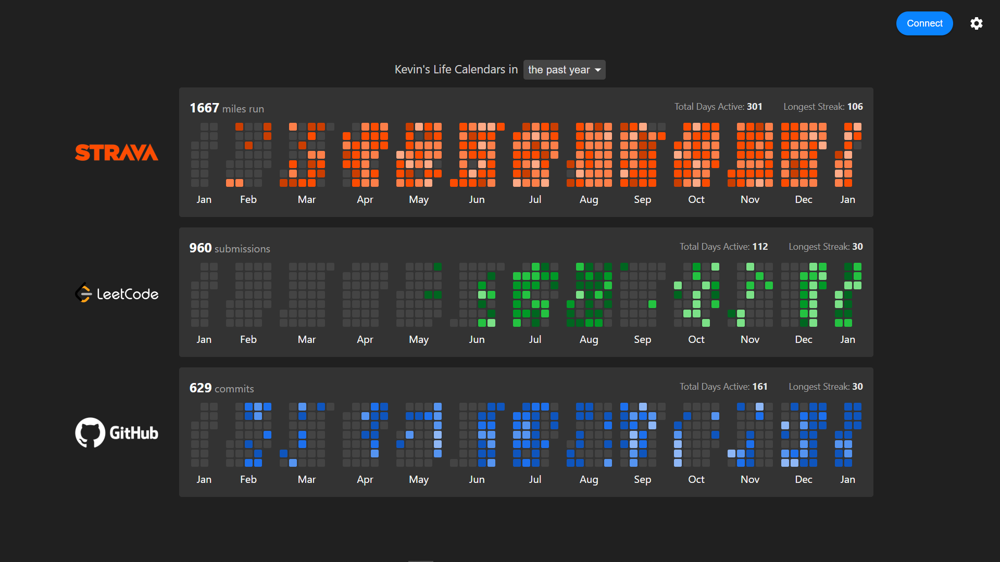

# Life Calendars
Visualize daily activity across Strava, LeetCode, and GitHub.

Life Calendars aggregates data from all three platforms through their respective APIs to display daily Strava mileage, LeetCode submissions, and GitHub contributions in a colorful and streamlined view.

## Key Features
- View separate daily calendars for LeetCode, GitHub, and Strava.
- Configure the year to display data for, making it easy to compare progress over time.
- Hover over a square to view the specific metric for that day.
- Utilizes caching to limit the number of API calls made.